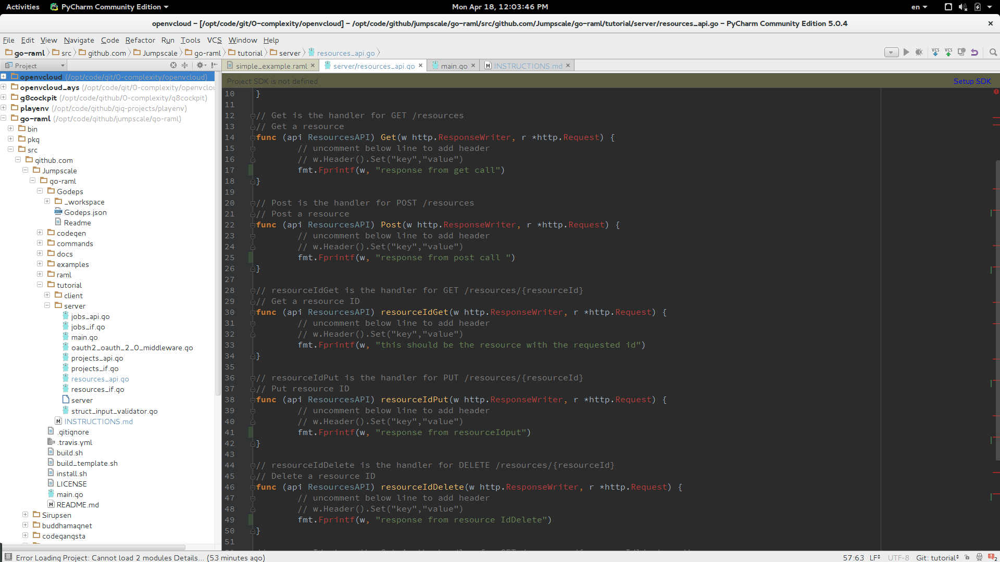
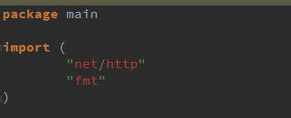
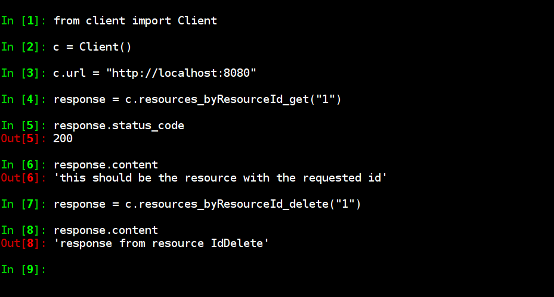

#Go-RAML Tutorial
1. export your GOPATH to your bashrc or .zhrc depending on what shell you are using

  ```
  $export GOPATH=/opt/go
  ```

  ```
  $export PATH=$PATH:$GOPATH/bin
  ```

2. Install godep as package manager

  ```
  $go get -u github.com/tools/godep
  ```

3. Install go-bindata, we need it to compile the template files to .go file

  ```
  $go get -u github.com/jteeuwen/go-bindata/...
  ```

4. Install go-raml

  ```
  $go get -u github.com/Jumpscale/go-raml
  ```

5. Build

  First, we need to compile the templates

  ```
  $cd $GOPATH/src/github.com/Jumpscale/go-raml
  $sh build.sh
  ```

6. create dir for generated code

  ```
  $mkdir tutorial
  ```
  ##Code Generation
  we will use simple_example.raml exists in the raml/samples

7. generate server code GoLang

  ```
  $go-raml server -l go --dir ./tutorial/server --ramlfile raml/samples/simple_example.raml
  ```

8. generate client code in python

  ```
  $go-raml client -l python --dir ./tutorial/client --ramlfile raml/samples/simple_example.raml
  ```

  you will find two new directories server and client

  ```
  $cd tutorial/server
  $go get github.com/gorilla/mux
  $go get gopkg.in/validator.v2
  ```

  ## Playing with the generated code
  we will edit methods of the server/resources_api.go method with any dummy response
  for example for resourceIdGet 

  <code>fmt.Fprintf(w, "this should be the resource with the requested id")</code>

  to resourceIdGet method 

  

  and don't forget to <code>import fmt</code>

  

  ```
  $go build
  $./server
  ```

9. open a new terminal and cd to client dir under tutorial

  install ipython you didn't have it

  ```
  $pip install ipython
  ```
  Run ipython 

  ```
  $ipython
  ```

  ```python
      from client import  Client  
      c = Client()  
      c.url = "http://localhost:8080"  
      response = c.resources_byResourceId_get("1")  
      print (response.content)  
  ```

  
  you can implement other methods in *_api.go files  to have more api calls
